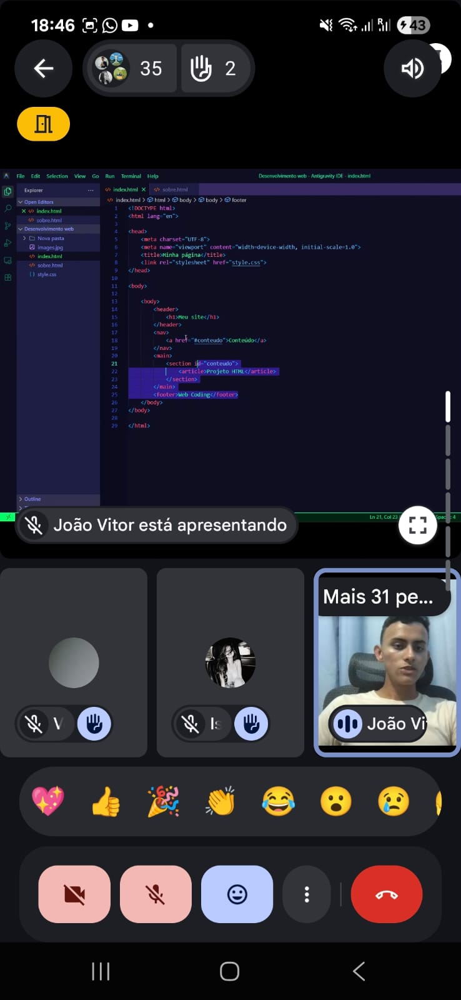
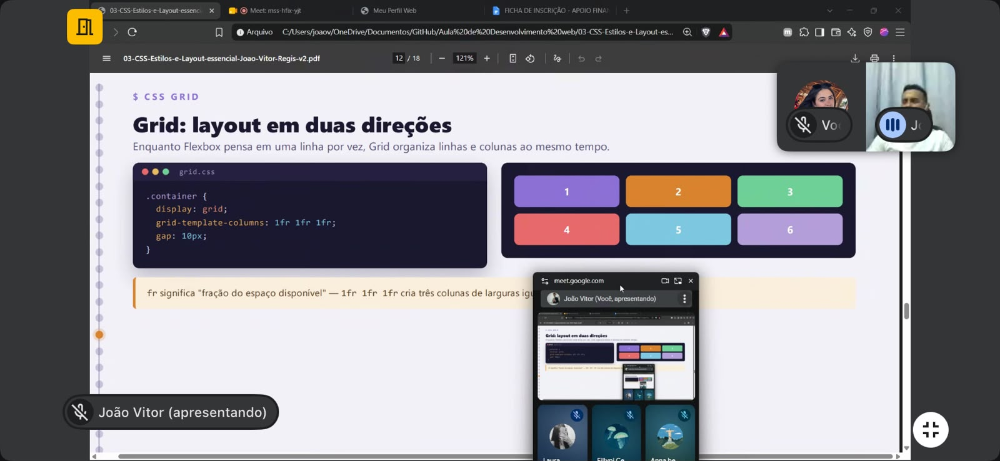
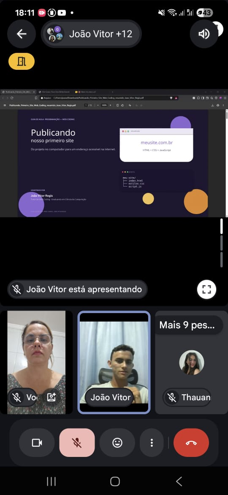

# Desenvolvimento Web

Materiais e registros de quatro encontros de introdução ao desenvolvimento web ministrados por João Vitor Regis, que atuou como tutor de Web Coding.

Os encontros abordaram HTML, CSS, JavaScript e publicação de sites. Este repositório reúne os PDFs das aulas e um site de demonstração para consulta e estudo.

## Materiais das aulas

| Encontro | Tema | PDF |
|---|---|---|
| 1 | Fundamentos da web e HTML5 | [Abrir material](materiais/01-html5.pdf) |
| 2 | CSS, estilos, layout e responsividade | [Abrir material](materiais/02-css.pdf) |
| 3 | JavaScript e formulário com alert | [Abrir material](materiais/03-javascript.pdf) |
| 4 | Publicação do primeiro site | [Abrir material](materiais/04-publicacao.pdf) |

Os materiais estão organizados por tema. A numeração da capa do PDF de CSS difere da ordem apresentada nesta tabela.

## Registros dos encontros


| 08/09/2026 | 16/09/2026 | 30/09/2026 |
|---|---|---|
|  |  |  |

[Ver todos os registros e sua procedência](registros/README.md).

## Site de demonstração

Abra `index.html` no navegador. O exemplo usa HTML, CSS e JavaScript puro e não precisa de instalação. Experimente o contador, a troca de tema e o formulário.

O formulário demonstra comportamento de interface com `alert`; ele não envia nem armazena inscrições. Os exemplos são materiais introdutórios e não representam uma aplicação com backend.

## Organização

```text
materiais/   PDFs dos quatro encontros
registros/   imagens agrupadas pelas datas dos arquivos originais
index.html   estrutura do site de demonstração
styles.css   apresentação visual
script.js    interações
```

## Autoria

João Vitor Regis · Web Coding.
